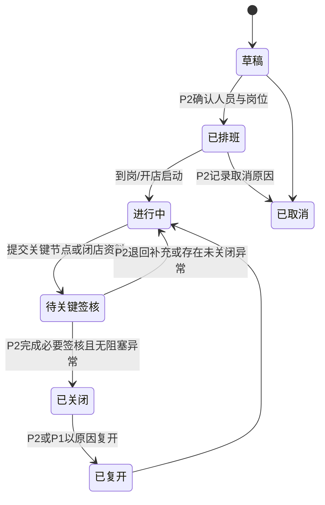
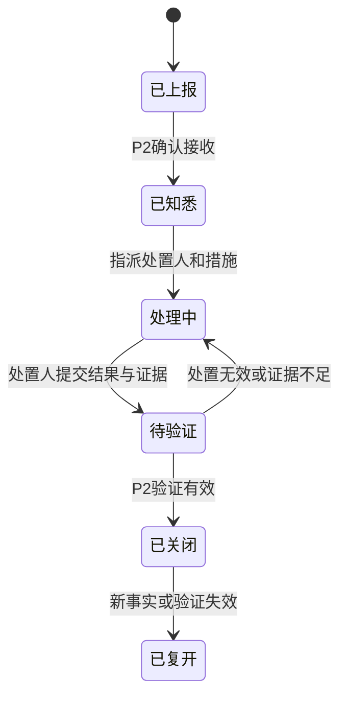
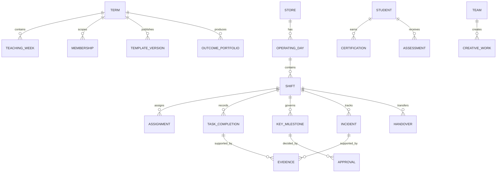

# 饮品生产性实训基地数字化运营系统

## 产品设计与业务需求文档

| 项目 | 内容 |
| --- | --- |
| 文档状态 | 产品基线，待评审后按分期实施 |
| 版本 | v1.0 |
| 适用范围 | 酒店管理学院饮品生产性实训基地 |
| 首次编制 | 2026-08-02 |
| 需求源稿 | 本文档；后续需求变更必须在本文档中记录 |

> 本文档定义目标产品，而非描述现有系统。现有 React、FastAPI、SQLite、PocketBase、旧单页原型及其数据均仅作为资料参考，不构成兼容约束。

## 1. 愿景、目标与边界

### 1.1 产品愿景

建设一个饮品生产性实训基地的数字化运营系统：以真实门店为教学现场，让学生在真实岗位中完成班次任务；让运营经理和教师在恰当的节点介入、指导和评价；将过程证据、能力认证、课程成绩和最终成果汇总为可追溯的实训档案。

系统不是“把纸质表单搬到线上”。每一项记录都必须回答以下至少一个问题：

- 当班成员是否完成了真实岗位责任？
- 门店的安全、服务、食品卫生和经营运行是否处于可控状态？
- 管理者是否已在需要介入的时间获得了充分证据？
- 学生是否由此获得了可评价、可复训、可展示的职业能力证据？

### 1.2 业务目标

1. 让学生看到明确的“我现在应做什么、做到什么程度、交给谁”。
2. 让 P2 运营经理能够在一个班次内完成定岗、关键放行、异常处置和闭店确认。
3. 让 T1 带教教师能够基于真实过程给出反馈、补训建议和教学评价，而不是事后收集表格。
4. 让 P1 教学督查能够配置学期规则、查看运行质量、发布评价规则并形成课程归档。
5. 让企业导师、院系领导等外部评审者安全地查看指定成果并完成评分。

### 1.3 成功标准

- 一个完整班次可在系统中从排班开始、以交接或闭店结束；每位参与者的下一步动作清晰可见。
- 关键节点的实际执行、证据、责任人、时间和确认结论可查询、可审计。
- 异常不会被“填报完成”掩盖：必须进入处置、验证与关闭链路。
- 每名学生的岗位经历、过程表现、反馈、认证和评分可自然汇总为课程成果。
- 规则变更通过 P1 管理的模板在后续学期或指定生效日期启用，无需修改程序。

### 1.4 产品边界

| 本系统负责 | 本系统不负责 |
| --- | --- |
| 班次、岗位、SOP、检查、照片/凭证、异常、交接、签核、带教、认证、评分、成果和归档 | POS 点单、商品目录、订单、供应商、采购订单、库存流水、收银清结算 |
| 经营数据摘要、来源链接/凭证、异常与教学口径的解释 | 替代学校教务系统、财务系统或企业收银系统的权威数据源 |

营业额、成本、损耗、库存等可以被记录为班次或运营日的**外部经营摘要**，但必须标记来源、采集人、采集时间和支持凭证；其明细事实以外部业务系统为准。

### 1.5 适用范围与默认原则

- 首个正式适用对象是饮品生产性实训基地，不将产品抽象为多业态通用低代码引擎。
- 饮品基地默认提供两人一组、连续轮值、开店—营业—闭店—交接的模板；具体人数、班次、时段、岗位、检查项、评分项均由 P1 配置。
- 系统采用中心化、多设备访问方式；手机与电脑均应可完成各自职责。
- 数据以全新模型启动，不迁移既有业务数据；旧系统仅保留为历史参考档案。

## 2. 术语与核心业务对象

| 术语 | 定义 |
| --- | --- |
| 学期 | 一组可配置的教学日历、人员范围、运行模板和评分规则。 |
| 教学周 | 学期内的课程周，用于组织动员、筹备、轮值、总结和展示。 |
| 运营日 | 某门店在一个自然日期内的运行容器，汇总该日所有班次、异常和经营摘要。 |
| 班次 | `日期 + 时段 + 门店` 的最小运营单元，是任务、证据、签核和交接的归属对象。 |
| 岗位分配 | 将某位学生或管理者安排至班次中的岗位，并明确职责、到岗要求和交接对象。 |
| SOP 模板 | 面向饮品基地的可版本化任务、检查项、证据要求、关键节点和适用岗位集合。 |
| 证据 | 照片、文件、文本说明、外部系统链接或经营摘要，用来证明某项工作或处置真实发生。 |
| 关键节点 | 需要 P2 放行或确认的开店、食品安全/关键库存、重大异常、闭店和交接等业务门槛。 |
| 异常 | 偏离标准运行、需要解释或处置的事件，如迟到、缺岗、低库存、损耗、客诉、设备和安全问题。 |
| 认证 | 对岗位或能力模块的达标结论；未达标可进入补训和复测。 |
| 成果包 | 汇总小组或学生在课程中的创意、运营、证据、反馈、认证、评分和展示材料的可评审档案。 |

## 3. 课程与运营运行模型

### 3.1 课程全周期

系统必须支持下列课程阶段，并允许 P1 按学期配置日期、任务和评分权重：

| 阶段 | 典型时间 | 业务目的 | 系统承载内容 |
| --- | --- | --- | --- |
| 导入与准备 | 第 1 周 | 统一标准、完成上岗准备 | 学期发布、分组、培训资料、基础学习确认、岗位规则说明 |
| 创意与筹备 | 第 2 周 | 完成市场调研、创意饮品和物料准备 | 调研任务、创意方案、配方、特殊物料清单、海报、教师反馈 |
| 滚动运营 | 第 3–16 周 | 在真实门店完成岗位轮值 | 排班定岗、班次执行、检查、证据、异常、交接、带教与认证 |
| 总结与评审 | 第 17 周 | 汇总手册、反思和优化方案 | 周/学期总结、个人反思、小组优化方案、预评分、成果包生成 |
| 展示与终评 | 第 18 周 | 展示创意与运营成果，形成最终结论 | 展示材料、外部评审入口、评分、成绩发布、证书/归档 |

### 3.2 日常运营主链路

日常运营是系统的第一主链路。每个班次遵循下列状态：

班次的固定业务顺序如下：

1. P2 创建或确认运营日，按模板生成班次和任务。
2. P2 完成定岗；学生收到个人当班任务、时段与标准。
3. P3 到岗后启动班次，完成开店、自检和必要证据提交。
4. P2 对开店及其他触发的关键节点进行确认、退回或处置。
5. 全体当班成员在班中记录任务完成、外部经营摘要和异常；异常优先于普通任务处理。
6. P3 完成闭店、清洁、经营摘要、交接草稿和证据；P2 完成闭店签核。
7. 若有下一班或下一组，交接双方完成交接确认；班次关闭后形成只读运行记录。
8. T1 可在班次进行中或结束后给出教学反馈、补训建议和观察记录，但不替代 P2 的现场放行职责。

### 3.3 关键节点与签核原则

系统采用**关键节点签核**，不要求对每一个普通清单项逐项审批。默认关键节点为：

- 开店与到岗准备；
- 食品安全、卫生或关键库存风险；
- 重大经营、服务、设备或安全异常；
- 闭店与经营摘要；
- 跨班次或跨小组交接。

P1 可通过模板增删关键节点及其证据要求。P2 对现场安全、服务、经营口径和关键放行负责；T1 对教学反馈、能力评价和补训建议负责。任何关键节点的退回、通过、复开或豁免都必须记录原因、操作者和时间。

### 3.4 异常闭环规则

- 所有角色均可上报异常；P3 只能修改本人上报且尚未被处理的草稿内容。
- P2 必须为阻塞性异常指定处置人、时限和临时控制措施。
- 食品安全、人员安全和重大服务风险应阻塞相应关键节点或班次关闭，除非 P2 以明确理由豁免。
- T1 可将异常关联为补训或评价依据，但不能关闭现场安全异常。
- 已关闭异常仅能由 P2 或 P1 复开；复开必须保留原处置轨迹。

### 3.5 交接规则

- 交接属于班次或轮值组之间的正式业务对象，不是自由文本备注。
- 交接至少包含未完成事项、库存/物料风险、设备与服务异常、外部经营摘要、下一步责任人和必要证据。
- 发起方提交后，接收方确认“已接收”或“退回补充”；P2 在关键交接时完成签核。
- 未完成交接、未关闭阻塞异常或未签核的闭店节点不得自动关闭班次。

## 4. 角色、权限与责任矩阵

| 角色 | 业务定位 | 必须完成 | 可以查看 | 不得执行 |
| --- | --- | --- | --- | --- |
| P3 实训学生 | 当班岗位执行者 | 接收定岗、执行任务、自检、提交证据、上报异常、提交交接、查看反馈 | 本人及被授权小组/班次的任务、记录、反馈与认证 | 放行关键节点、关闭安全异常、修改评分规则、访问其他无关学生数据 |
| P2 运营经理 | 现场运营负责人 | 建立运营日、排班定岗、关键签核、异常处置与验证、闭店/交接确认 | 所负责门店和班次的完整运行数据、经营摘要和证据 | 发布课程最终成绩、修改教学评分量规、删除审计记录 |
| T1 运营督查 | 带教与教学观察者 | 查看过程、给出反馈、创建补训建议、提交教学评价 | 分配范围内的学生、班次、认证与成果 | 替代 P2 放行现场安全节点、修改经营摘要事实、关闭现场安全异常 |
| P1 教学督查 | 课程与制度治理者 | 管理学期、人员、模板、权限、评分规则、成果发布与归档策略 | 全局配置和授权范围内的全部汇总/审计数据 | 绕过审计删除已发布结果；以普通操作替代 P2 的现场责任 |
| 外部评审者 | 成果评审参与者 | 查看被邀请的成果包、提交评分与评语 | 仅被邀请的展示材料、成果摘要和评分量规 | 查看日常个人隐私、编辑过程记录、管理运营或教学规则 |

### 4.1 权限设计要求

- 权限必须基于角色、门店、学期、班次和显式评审邀请共同判定，不能仅依赖前端菜单隐藏。
- P3 的默认可见范围为本人当前及历史获授权记录；协作组范围由 P2/P1 配置并有有效期。
- P2、T1 的数据范围由门店、班次或学生分配决定；P1 可配置其覆盖范围。
- 每次角色、范围、模板、评分和归档策略变更均进入审计日志。

## 5. 完整能力地图与业务需求

### 5.1 组织、学期与模板治理

| 编号 | 需求 |
| --- | --- |
| BR-GOV-01 | P1 可创建学期并配置教学周、门店、适用人员、阶段日期和归档策略。 |
| BR-GOV-02 | P1 可管理用户、角色、所属班级/小组、门店与授权范围。 |
| BR-GOV-03 | P1 可维护岗位模板、班次模板、SOP 模板、关键节点、异常分类、认证规则和评分量规，并以版本号和生效时间发布。 |
| BR-GOV-04 | 已开始或已关闭的班次必须保留当时使用的模板快照；后续模板修改不得回写历史事实。 |
| BR-GOV-05 | 系统必须提供变更记录，包含变更人、时间、内容、影响范围和生效规则。 |

### 5.2 班次、排班与岗位

| 编号 | 需求 |
| --- | --- |
| BR-SHF-01 | P2 可按日期、门店和模板创建运营日与班次；系统应展示冲突、缺岗和未完成排班。 |
| BR-SHF-02 | P2 可将学生分配至岗位，并指定时段、职责、到岗要求和交接关系。 |
| BR-SHF-03 | 班次或定岗调整必须通知受影响人员，并记录调整原因和操作者。 |
| BR-SHF-04 | P3 可查看本人当前、下一班和近期历史班次；不得自行改变岗位或班次。 |
| BR-SHF-05 | 取消班次必须有原因；已产生证据或异常的班次不得删除，只能取消或关闭。 |

### 5.3 当班执行、SOP 与证据

| 编号 | 需求 |
| --- | --- |
| BR-OPS-01 | P3 首页必须以“我的当班”为核心，展示当前状态、岗位、待办、关键节点、异常、交接和被退回项。 |
| BR-OPS-02 | 班次任务按岗位、时间段和关键程度组织；每个任务定义执行标准、是否需要证据、是否关联认证。 |
| BR-OPS-03 | P3 可完成、补充说明或上报阻碍；已提交的关键证据可被 P2 通过或退回补充。 |
| BR-OPS-04 | 证据支持照片、文件、文本说明、外部链接和经营摘要；系统记录上传者、拍摄/发生时间、提交时间和适用对象。 |
| BR-OPS-05 | 证据不得被静默替换或删除；替换、撤回和退回必须保留版本与原因。 |
| BR-OPS-06 | P2 首页必须以“今日运营”为核心，突出待排班、待签核、未关闭异常、临近交接和缺少关键证据的班次。 |

### 5.4 外部经营摘要

| 编号 | 需求 |
| --- | --- |
| BR-DATA-01 | 班次和运营日可登记营业额、成本、损耗、关键库存状态及备注，作为教学和运行摘要。 |
| BR-DATA-02 | 每项摘要必须标识来源系统/表单、采集方式、采集人、采集时间和凭证或链接。 |
| BR-DATA-03 | 系统不维护订单、商品、采购或库存流水；若外部数据不可用，允许标记“待补充”并形成待办，不得伪造零值。 |
| BR-DATA-04 | P2 确认经营摘要的教学口径与异常解释；P1 可配置展示字段与异常阈值。 |

### 5.5 带教、补训与岗位认证

| 编号 | 需求 |
| --- | --- |
| BR-EDU-01 | T1 可基于班次、任务、异常或证据创建结构化反馈，指定对象、建议、是否要求补训和截止日期。 |
| BR-EDU-02 | 补训具有“待完成、已提交、待复测、通过、未通过/需再次补训”状态，并保留关联证据。 |
| BR-EDU-03 | 岗位认证以模板定义达标条件、证据、复测要求和有效范围；认证结论由授权角色提交。 |
| BR-EDU-04 | 食品安全等红线事项可由模板自动要求补训/复测；处罚在教学中表现为绩效扣分、补训或复测，而非现金处罚。 |
| BR-EDU-05 | 每名学生可查看自身认证进度、反馈历史、待补训事项和可执行的改进动作。 |

### 5.6 课程筹备、创意与成果

| 编号 | 需求 |
| --- | --- |
| BR-CRS-01 | 系统支持发布课程资料、上岗前学习确认、调研任务、创意饮品方案、配方、特殊物料清单和电子海报。 |
| BR-CRS-02 | 创意成果必须归属小组、学期和教学阶段，并支持教师反馈、版本更新和发布状态。 |
| BR-CRS-03 | 系统可将轮值过程、创意成果、个人反思、小组优化方案、认证和评分汇总为成果包。 |
| BR-CRS-04 | 成果包支持按学生、小组、学期和阶段筛选，生成可打印/导出的归档材料；导出不取代系统内的原始审计记录。 |

### 5.7 评分、终评与外部评审

| 编号 | 需求 |
| --- | --- |
| BR-ASM-01 | P1 可通过版本化量规配置过程证据、运营表现、认证、创意成果、反思和展示的权重、维度及及格规则。 |
| BR-ASM-02 | P2、T1 和外部评审者只能在被授予的维度与对象范围内评分；各方评分来源必须可区分。 |
| BR-ASM-03 | 系统自动汇总符合条件的过程证据和评分，生成最终建议成绩与认证结论；最终发布由 P1 授权。 |
| BR-ASM-04 | 成绩发布后进入只读状态；如需更正，P1 必须以更正记录方式发布，保留原版本、原因和审批信息。 |
| BR-ASM-05 | 外部评审者使用受限的只读成果与评分入口，不得访问学生无关的过程记录和个人信息。 |

### 5.8 通知、审计与归档

| 编号 | 需求 |
| --- | --- |
| BR-COM-01 | 系统应向相关人员推送定岗变更、关键节点待签核、异常指派/超期、证据退回、交接待确认、反馈、补训和评分发布通知。 |
| BR-COM-02 | 通知至少在站内实时可见；外部通知渠道可作为后续扩展，不得成为业务闭环的唯一依赖。 |
| BR-AUD-01 | 用户、角色、模板、班次、任务、证据、签核、异常、交接、评分和归档的关键操作必须产生不可静默删除的审计日志。 |
| BR-ARC-01 | 过程证据、签核、成绩与成果自产生之日起在线保留至少 5 年；期满后进入受限只读归档。 |
| BR-ARC-02 | 归档数据保留检索、导出与审计能力，不允许按普通业务流程修改。 |

## 6. 信息架构与页面蓝图

### 6.1 P3：学生工作台

| 导航/页面 | 页面目标 | 主要对象与动作 |
| --- | --- | --- |
| 我的当班 | 让学生立即进入当前职责 | 班次状态、岗位、待办、关键节点、异常、交接、被退回证据 |
| 我的日程 | 了解近期上岗安排 | 当前/下一班、时段、岗位、变更通知 |
| 任务与证据 | 完成并证明岗位工作 | 任务、自检、提交/补充证据、说明阻碍 |
| 异常与交接 | 处理风险和移交事项 | 上报异常、查看处置、提交/确认交接 |
| 学习与成长 | 完成课程过程 | 资料、调研、创意、反馈、补训、认证、个人反思 |
| 我的成果 | 查看可展示档案 | 过程摘要、成绩、认证、成果包与导出状态 |

### 6.2 P2：运营经理工作台

| 导航/页面 | 页面目标 | 主要对象与动作 |
| --- | --- | --- |
| 今日运营 | 掌控当前门店风险和进度 | 待排班、班次状态、关键签核、异常、交接、经营摘要 |
| 排班定岗 | 建立可执行班次 | 运营日、班次、学生、岗位、变更与缺岗处理 |
| 签核中心 | 快速放行或退回关键节点 | 开店、食品安全/库存、异常、闭店、交接及其证据 |
| 异常中心 | 处置和验证风险 | 分类、级别、责任人、时限、临时措施、关闭验证 |
| 运行记录 | 复盘已结束班次 | 运营日、班次、经营摘要、证据、审计与复开 |

### 6.3 T1：带教督查工作台

| 导航/页面 | 页面目标 | 主要对象与动作 |
| --- | --- | --- |
| 带教观察 | 找到需要教学介入的人与事 | 班次过程、异常、证据缺口、学生表现 |
| 反馈与补训 | 形成改进闭环 | 反馈、补训、复测、认证建议 |
| 学生成长 | 进行课程过程评价 | 学生档案、认证、评分维度、反思和成果 |
| 课程筹备 | 指导创意与准备阶段 | 资料、调研、方案、配方、海报与反馈 |

### 6.4 P1：教学督查与治理工作台

| 导航/页面 | 页面目标 | 主要对象与动作 |
| --- | --- | --- |
| 运行总览 | 查看学期和门店健康度 | 班次完成、异常趋势、签核时效、学生/小组进度 |
| 学期与人员 | 管理组织边界 | 学期、教学周、门店、用户、小组、授权范围 |
| 模板中心 | 管理可配置规则 | 岗位、班次、SOP、关键节点、认证、评分量规 |
| 课程与成果 | 组织全过程教学 | 任务、资料、创意成果、成果包、成绩发布 |
| 归档与审计 | 管理合规留存 | 导出、归档、权限变更、审计查询和更正记录 |

### 6.5 外部评审入口

- 评审者通过受限邀请进入指定学期、展示活动、学生或小组的成果包。
- 页面只包含展示材料、允许查看的摘要、评分量规、评分表、评语和提交状态。
- 不显示日常运营中的个人隐私、内部异常细节、未公开评分和无关学生信息。

## 7. 数据、接口与实时协作边界

### 7.1 概念数据关系

### 7.2 数据要求

- 业务事实使用 PostgreSQL 中的关系型模型保存；不以单个周度 JSON 作为主记录。
- 图片、视频、文件和凭证存入受控服务器文件目录；数据库仅保存相对路径、元数据、访问权限、版本和关联关系，绝不保存二进制内容或服务器绝对路径。
- 每个事实对象必须至少具有唯一标识、归属学期/门店/班次或成果范围、状态、创建/更新时间、创建者和审计轨迹。
- 需要明确的版本对象包括：SOP 模板、评分量规、创意成果、证据、成绩发布和归档包。

### 7.3 服务接口边界

接口按业务资源设计，不按页面或旧系统接口迁移。至少需要以下资源族：

- 身份与范围：当前用户、角色、授权范围、评审邀请；
- 治理：学期、教学周、门店、人员、团队、模板和量规；
- 运营：运营日、班次、岗位分配、任务完成、关键节点、经营摘要；
- 风险：异常、处置、验证、交接和通知；
- 教学：课程资料、任务、创意成果、反馈、补训、认证、评分和成果包；
- 合规：证据访问、审计、归档和导出。

所有变更接口必须由服务端执行权限和状态校验，并返回最新版本号/更新时间，避免客户端覆盖他人刚完成的操作。

### 7.4 实时协作

- 系统使用按门店、运营日和班次授权的 WebSocket 事件流同步关键状态。
- 班次状态、岗位分配、任务/证据提交、关键签核、异常、交接和通知发生变化时，相关角色应自动刷新。
- 实时事件仅用于更新界面；业务写入仍通过受权限保护、可审计的服务端命令完成。
- 网络短暂中断时，界面必须明确提示离线/重连状态；未成功提交的操作不得显示为已完成。

## 8. 非功能需求

| 范畴 | 需求 |
| --- | --- |
| 访问方式 | 中心化部署；支持现代桌面浏览器与常见手机浏览器，按角色优先保证当班操作在手机端可用。 |
| 并发与一致性 | 多角色可同时查看同一班次；服务端处理版本冲突、幂等提交和状态越权。 |
| 性能体验 | 当前班次、待办和关键状态应优先加载；大文件处理不得阻塞普通文字、签核和异常操作。 |
| 安全 | 使用统一身份认证、最小权限、服务端授权、受限媒体访问、传输加密和审计日志。 |
| 隐私 | 学生仅查看与本人职责相关的信息；外部评审最小化访问个人数据和内部运行详情。 |
| 可追溯 | 关键事实不可静默修改或删除；更正、退回、复开和发布必须保留前后记录。 |
| 归档 | 在线保留至少 5 年；之后受限只读归档，仍可检索、导出和审计。 |
| 可配置 | 学期、班次、岗位、SOP、关键节点、认证和评分规则由 P1 模板化配置并版本化。 |

## 9. 分期路线图

### 阶段 0：产品与运行准备

- 建立本文档的变更管理机制、术语、默认饮品基地模板和试点班次场景。
- 确认身份认证方式、对象存储服务、外部经营数据来源和首个试点学期。
- 建立全新数据环境，不导入旧业务记录。

### 阶段 1：四角色日常运营闭环

目标：让 P3、P2、T1、P1 都能在同一真实运营日完成自己的最小闭环。

- P1 配置人员、门店、班次、岗位、SOP 与关键节点模板；
- P2 排班定岗、查看今日运营、签核关键节点、处置异常和关闭班次；
- P3 接收当班、执行任务、提交证据、上报异常和完成交接；
- T1 查看过程、提交反馈和补训建议；
- 支持审计、站内实时通知、手机端当班操作和外部经营摘要。

### 阶段 2：课程全过程与能力成长

- 接入课程资料、上岗准备、调研、创意饮品、配方、特殊物料和海报。
- 接入补训/复测、岗位认证、个人反思、小组优化方案和成果包。
- 支持可配置评分量规、P2/T1 过程评价和学生成长视图。

### 阶段 3：终评、评审与治理分析

- 提供外部评审只读与评分入口、展示活动与最终成绩发布。
- 提供运营质量、带教时效、认证进度、风险趋势和课程成果的治理分析。
- 完成长期归档、导出、只读查询和发布后更正流程。

## 10. 业务验收场景

| 场景 | 前置条件 | 关键动作 | 通过标准 |
| --- | --- | --- | --- |
| 完整班次 | P1 已发布模板，P2 已排班 | P3 执行开店、班中、闭店任务；P2 完成关键签核 | 班次可关闭，任务、证据、签核和经营摘要均可追溯 |
| 异常闭环 | 班次进行中 | P3 上报低库存/设备/服务异常；P2 指派处置并验证 | 异常未经验证不能被标记关闭；关闭后仍可查看全过程 |
| 带教与补训 | T1 发现表现不足或异常 | T1 创建反馈和补训；P3 提交补训；授权人员复测 | 反馈、补训、复测与认证结论具有关联且学生可见下一步 |
| 排班变更 | 班次已排班 | P2 调整岗位或人员 | 受影响人员收到通知；变更原因和前后安排进入审计 |
| 成果与评分 | 课程阶段完成 | 系统汇总创意、班次、认证、反思；多方按量规评分 | 评分来源可区分，最终建议成绩可解释，P1 发布后只读 |
| 外部评审 | 成果包已发布 | 企业导师访问受限入口并提交评分 | 仅能访问被邀请成果；评分有效进入总评，无法查看内部隐私数据 |
| 五年归档 | 数据达到归档条件 | P1 执行或确认归档 | 记录转只读，仍支持授权查询、导出和审计，普通用户不能修改 |

## 11. 待决事项与决策责任

下列事项不允许由开发人员自行假设；应在对应阶段开始前由指定责任方决策并回写本文档。

| 编号 | 待决事项 | 决策责任方 | 最晚决策阶段 |
| --- | --- | --- |
| DQ-01 | 统一身份认证方式（本地账号、学院统一认证或其他方式） | P1/学院信息化负责人 | 阶段 1 开始前 |
| DQ-02（已关闭，一期） | 服务端受控文件目录 `/data/beverage-ops/media`；后端 Multipart 上传、数据库相对路径与元数据、按请求鉴权下载；不做备份或病毒扫描；仅清理三天前已替换/撤回的历史物理文件 | 技术负责人/学院信息化负责人 | 已于 2026-08-19 确认 |
| DQ-03 | 首个试点门店、试点学期、实际班次模板及参与人员 | P1/P2 | 阶段 0 结束前 |
| DQ-04 | 外部 POS、库存或财务数据的具体来源和凭证格式 | P2/门店负责人 | 阶段 1 经营摘要开发前 |
| DQ-05 | 默认岗位认证条件、补训时限与评分量规的具体权重 | P1/T1/P2 | 阶段 2 开始前 |
| DQ-06 | 外部评审者名单、邀请有效期和成果公开范围 | P1/课程负责人 | 阶段 3 开始前 |
| DQ-07 | 五年期满后的存储位置、销毁/续存制度和隐私审批流程 | 学院管理方/信息化负责人 | 阶段 3 上线前 |

## 12. 变更管理

- 本文档是后续实现任务、原型、接口、测试用例和验收的上游依据。
- 新增或变更需求必须说明：业务目标、受影响角色、状态规则、数据影响、验收场景、分期归属和对已归档记录的影响。
- 若实现与本文档不一致，应先更新并评审本文档，再开始实现；不得以现有代码行为倒推产品规则。
- 每个实施阶段完成后，应在本文档中补充实现状态、实际限制、已关闭待决事项和经批准的变更记录。

## 13. 依据材料

- [门店创意饮品策划与运营实践教学启动仪式 PPT 提纲](../../门店创意饮品策划与运营实践教学启动仪式PPT提纲.docx)
- [饮品实训基地学生运营手册（学院制度发布版）](../../饮品实训基地学生运营手册_学院制度发布版V7_全册导出Word含图.html)
- [现有工程使用说明](../../使用说明_实训系统.md)

## 14. 实现状态与变更记录

### 2026-08-16 后端实现审计

- 后端当前采用 Java 21、Spring Boot 3.4.5、Spring AI 1.0 BOM、PostgreSQL 与 Flyway 的 DDD 模块化单体；一期没有 AI 供应商、模型、密钥或 AI 请求路径。
- 系统仅从全新 PostgreSQL 业务模式启动，不迁移、不读取、不映射、不双写且不兼容 SQLite、PocketBase、FastAPI 或旧前端业务记录。
- 阶段 1 的日常运营主链路，以及阶段 2 的反馈、补训、复测、通用岗位认证、课程资料、课程任务、小组创意成果、教师反馈、发布和个人反思子链路已实现。认证规则在发布时必须定义授权决定角色、证据数量与复测要求；通过结论会校验同一学生、学期和门店范围内的证据/已通过补训，并保留不可覆盖的决定和审计轨迹。课程资料和海报等文件当前只保存 JSON 或受控对象引用元数据。
- DQ-05 尚未确认正式岗位达标条件、补训时限和评分量规权重；食品安全等红线异常的自动补训/复测联动也尚未实施。因此不得把通用认证能力表述为完整教学认证制度。评分量规、成果包和内部成绩发布已完成：P1 创建带谱系修订和生效时间的量规，P2/T1 在获授维度内评分，系统生成确定性建议成绩，P1 发布并以线性更正版本保留来源；成果包生成仅快照获授权的运营/学习事实，且 P1 内部导出清单读取会写审计。外部评审、五年归档和对象存储仍未全部完成。
- 详细的业务规则、接口、自动化验收与缺口映射见 [PRD 后端实现追踪矩阵](../traceability/prd-api-acceptance-matrix.md)。
- 2026-08-19：DQ-02 已确认采用服务器受控文件目录而非对象存储服务。生产根目录为 `/data/beverage-ops/media`，数据库只保存受控相对路径和元数据；图片/PDF/`.docx`/`.xlsx`/`.pptx` 上限 50 MB，`.mp4`/`.webm`/`.mov` 上限 500 MB；拒绝旧 Office 和宏 Office。后端临时上传、内容校验、原子移动与授权下载，视频支持 Range；没有病毒扫描或备份。已替换/撤回历史物理文件三天后可清理，但当前有效文件、版本元数据与审计记录不得因此删除。详细设计见 [服务端媒体文件存储设计](2026-08-19-server-media-storage-design.md)。
- DQ-05、DQ-06、DQ-07 仍保持开放状态，开发人员不得自行补充岗位达标阈值、邀请策略或归档销毁制度。
